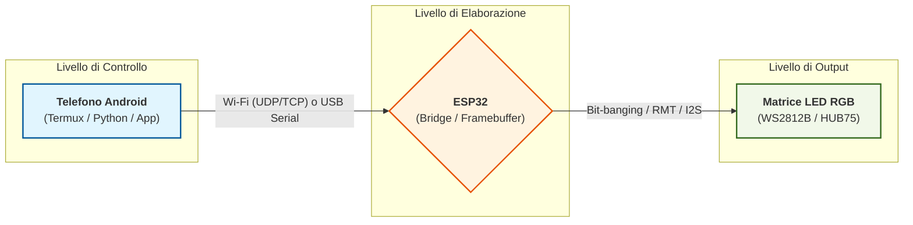

# Guida Completa — Display LED con Telefono + ESP32 + Matrice RGB

# Indice

1. Obiettivo del progetto
2. Architettura generale
3. Tipi di LED
4. Quale scegliere
5. Perché non usare direttamente USB del telefono
6. Hardware consigliato
7. Configurazione matrici grandi
8. Librerie ESP32
9. Ruolo reale dell’ESP32
10. Comunicazione telefono → ESP32
11. WLED
12. Software telefono Android
13. Testo scorrevole
14. GIF e immagini
15. Alimentazione
16. Limitazione luminosità
17. Setup finale consigliato
18. Conclusioni

# Guida Completa — Display LED con Telefono + ESP32 + Matrice RGB

## Obiettivo del progetto

Realizzare un display LED RGB controllato da un telefono Android:

* scritte scorrevoli
* immagini
* GIF
* animazioni
* effetti realtime

con architettura:

* Telefono = cervello/logica/rendering
* ESP32 = bridge/framebuffer/output LED

---

# Architettura generale




L’ESP32 non deve generare effetti complessi.
Il telefono genera:

* testo
* frame RGB
* GIF
* animazioni
* immagini

L’ESP32:

* riceve dati
* mantiene framebuffer
* aggiorna i LED

---

# Tipi di LED

| Caratteristica              | WS2812B          | SK9822                  |
| --------------------------- | ---------------- | ----------------------- |
| Protocollo                  | 1 filo dati      | DATA + CLOCK            |
| Tipo comunicazione          | Timing-sensitive | Tipo SPI                |
| Stabilità                   | Media            | Alta                    |
| Velocità refresh            | Più lenta        | Molto veloce            |
| FPS                         | Medi             | Alti                    |
| Costo                       | Più economico    | Leggermente più costoso |
| Cablaggio                   | Più semplice     | Un filo in più          |
| Compatibilità tutorial      | Molto ampia      | Buona                   |
| Adatto a matrici grandi     | Poco ideale      | Ottimo                  |
| Adatto a GIF/video          | Limitato         | Molto adatto            |
| Uso con ESP32               | Buono            | Ottimo                  |
| Streaming realtime          | Limitato         | Ideale                  |
| Stabilità su grandi matrici | Minore           | Maggiore                |

## Quale scegliere

| Scenario                        | LED consigliato |
| ------------------------------- | --------------- |
| Progetti semplici               | WS2812B         |
| Display grandi                  | SK9822          |
| Testo scorrevole                | SK9822          |
| GIF e immagini                  | SK9822          |
| Video LED                       | SK9822          |
| Streaming realtime dal telefono | SK9822          |
| Budget ridotto                  | WS2812B         |
| Massima semplicità              | WS2812B         |
| Alte prestazioni                | SK9822          |


# Perché non usare direttamente USB del telefono

La USB del telefono:

* fornisce alimentazione
* trasporta dati USB

ma NON espone:

* GPIO
* DATA LED
* CLOCK LED

I LED richiedono segnali digitali precisi:

* HIGH/LOW
* timing accurato
* clock dedicato

Per questo serve un microcontrollore intermedio.

---

# Hardware consigliato

## Controller

### ESP32 DevKit

Buono per:

* piccoli display
* prototipi
* matrici medie

---

### ESP32-S3

Consigliato per:

* matrici grandi
* output paralleli
* streaming video
* refresh elevato

Vantaggi:

* più RAM
* USB nativa
* DMA migliore
* performance superiori

---

# Matrice esempio

## 16 x 160

Totale LED:

```text
16 × 160 = 2560 LED
```

---

# Configurazione consigliata per 2560 LED

## EVITARE

Una singola catena:

```text
2560 LED in serie
```

Perché:

* refresh lento
* FPS bassi
* latenza alta

---

## CONSIGLIATO

Output paralleli:

```text
ESP32
├── strip 1  -> 160 LED
├── strip 2  -> 160 LED
├── strip 3  -> 160 LED
...
├── strip16  -> 160 LED
```

Vantaggi:

* refresh molto più veloce
* FPS alti
* animazioni fluide
* minor latenza

---

# Librerie ESP32

## FastLED

Utilizzata per:

* pilotaggio LED
* DMA
* timing
* output parallelo
* power limiting

---

## NeoPixelBus

Alternativa moderna con:

* supporto ESP32
* DMA
* SPI
* output efficienti

---

# Ruolo reale dell’ESP32

Anche usando FastLED o NeoPixelBus:

l’ESP32 può rimanere quasi completamente “stupido”.

## Cosa NON deve fare

* generare effetti complessi
* creare GIF
* renderizzare testo
* fare AI
* generare animazioni

## Cosa deve fare

* ricevere frame RGB
* mantenere framebuffer
* inviare dati ai LED

---

# Pipeline consigliata

```text
Telefono
  ↓ genera frame RGB
Wi‑Fi UDP/DDP/WebSocket
  ↓
ESP32 framebuffer
  ↓ DMA parallelo
LED
```

---

# Comunicazione telefono → ESP32

## Modalità consigliata

### Wi‑Fi

Più semplice e veloce di USB seriale.

---

## Protocolli possibili

### UDP

Molto veloce.

---

### DDP

Ottimo per streaming LED realtime.

---

### WebSocket

Comodo per applicazioni interattive.

---

# WLED

## Cos’è

Firmware già pronto per ESP32.

Permette:

* controllo LED
* matrici
* effetti
* API HTTP
* DDP
* WebSocket

---

## Quando usarlo

Se si vuole:

* programmare pochissimo ESP32
* controllare tutto dal telefono
* avere setup rapido

---

# Telefono Android

## Software consigliato

### Termux

Permette:

* Python
* Bash
* Node.js
* networking

---

# Librerie Python utili

## Pillow

Per:

* testo
* immagini
* rendering bitmap

---

## OpenCV

Per:

* video
* GIF
* elaborazione immagini

---

## socket / asyncio

Per:

* invio realtime frame RGB

---

# Testo scorrevole

## Come funziona

Le lettere vengono convertite in bitmap.

Esempio:

```text
01110
10001
11111
10001
10001
```

Poi la bitmap viene spostata orizzontalmente frame dopo frame.

---

# Dove generare il testo

## Consigliato

Generare il testo sul telefono.

Il telefono:

* crea bitmap
* genera frame
* invia frame RGB

L’ESP32:

* visualizza solamente.

---

# GIF e immagini

Pipeline tipica:

```text
GIF/video
↓
Python Pillow/OpenCV
↓
frame RGB
↓
Wi‑Fi
↓
ESP32
↓
LED
```

---

# Alimentazione

## IMPORTANTISSIMO

Una matrice RGB grande richiede moltissima corrente.

---

# Consumo teorico

RGB bianco pieno:

```text
~60mA per LED
```

Esempio:

```text
2560 LED ≈ 150A teorici
```

---

# Ma nella realtà

Con:

* testo scorrevole
* pochi LED accesi
* luminosità limitata

il consumo reale è MOLTO inferiore.

---

# Limitare la luminosità

## Metodo semplice

```cpp
FastLED.setBrightness(64);
```

Range:

```text
0–255
```

---

# Power limiting automatico

Metodo consigliato:

```cpp
FastLED.setMaxPowerInVoltsAndMilliamps(5, 30000);
```

Questo:

* limita corrente massima
* evita overload alimentatore
* riduce automaticamente luminosità

---

# Alimentatore consigliato

Per matrici grandi:

```text
5V 20A – 40A
```

in base a:

* numero LED
* luminosità
* tipo animazioni

---

# Iniezione alimentazione

NON alimentare tutta la matrice da un solo punto.

## Regola pratica

Alimentare:

* ogni strip
  oppure
* ogni 1–2 metri

---

# Collegamenti fondamentali

## Sempre collegare insieme

* GND alimentatore
* GND ESP32
* GND matrice LED

---

# Setup finale consigliato

## Hardware

* ESP32-S3
* 16 strip parallele da 160 LED
* SK9822
* alimentatore 5V 30A–40A

---

## Software ESP32

### Opzione semplice

* WLED

### Opzione avanzata

Firmware minimale framebuffer:

* ricevi UDP/DDP
* copia buffer
* show()

---

## Software telefono

* Android
* Termux
* Python
* Pillow
* OpenCV

---

# Architettura finale ideale

```text
Telefono Android
  ├── genera testo
  ├── genera GIF
  ├── genera immagini
  ├── genera animazioni
  └── invia frame RGB
            ↓
ESP32-S3 bridge/framebuffer
            ↓
Output paralleli DMA
            ↓
Matrice SK9822
```

---

# Conclusioni

Per un display LED moderno:

* il telefono può fare tutta la logica
* ESP32 può essere quasi solo un bridge
* SK9822 è ideale per matrici grandi
* output paralleli sono fondamentali
* FastLED/NeoPixelBus gestiscono timing e DMA
* WLED è ottimo per iniziare rapidamente

Questa architettura permette:

* testo scorrevole
* GIF
* immagini
* animazioni realtime
* video LED
* effetti dinamici

con ottime prestazioni e minima complessità firmware su ESP32.
